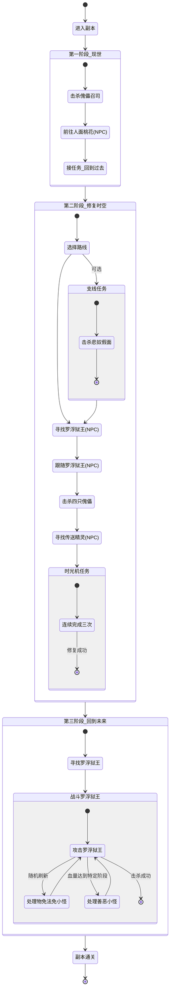
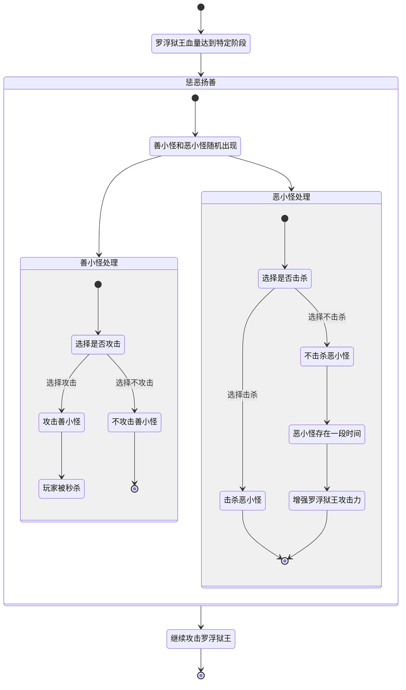
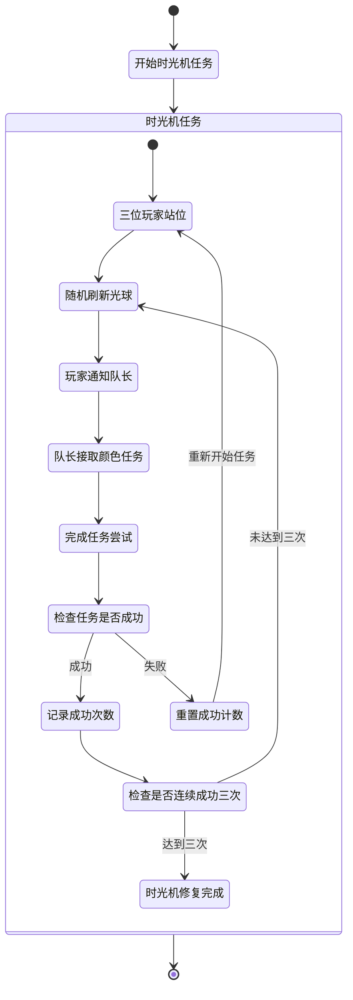

## 主流程图

## 善恶小怪机制专用流程图

## 时光机任务改进流程图

#### **关于怪物机制**
#### 1.傀儡召司  
- **核心机制**：  
  - 战斗中会随机**关押1名玩家**，并召唤与该玩家职业相同的**傀儡怪物**。  
  - 必须击杀傀儡才能解救队友。  

#### 2.悲奴假面
靠近悲奴假面打，及时驱散回血技能就可以了
悲奴假面攻击强的时候可能会随机秒人（这个没经历过，不太确定机制，这个版本可能可以秒吧）

####  3.罗浮狱王
击杀时会随机刷出物免和法免小怪（当时是由法系和物理系开阵群小怪的）
罗浮狱王血量攻击到一定阶段会随机刷新善、恶两个小怪，杀善和不杀恶都会增加罗浮狱王的攻击力（罗浮狱王攻击高的情况下会团灭）
（Ps：我们这边版本会不会团灭完全取决于怪物设置的攻击力和血量）

#### **关于副本流程**  
- **第一阶段（现世）**：
  - 进入副本后先从地图上找到傀儡召司位置，将其击杀。
  - 由队长前往地图中人面桃花的位置，，与**人面桃花NPC**对话，触发时空穿越剧情（桃花处看到罗浮狱王是处于无敌状态）。  
  - 玩家中途不要打坐，否则传送失败 。

- **第二阶段（过去时空）**：  
  -先击杀悲奴假面（大地图查看位置）
  - 找到罗浮狱王（大地图查看位置），并跟随他，找到四只傀儡职业并击杀。
  - 找到传送精灵（NPC），接取时光机任务：
  - 时光机任务
    1.1此处需要三位玩家配合，玩家ABC分别站到地图上的（红、黄、白、绿的三个点）附近，任务开启后会随机刷新一个点的光球。
    1.2队长接任务 修复时光机，玩家ABC中谁的颜色光球出现了则谁告知队长，由队长接取相应的颜色完成后续任务（此任务需接取三次才能修复时光机）

- **第三阶段（回到过去）**：  
  -击杀罗浮狱王，任务通关